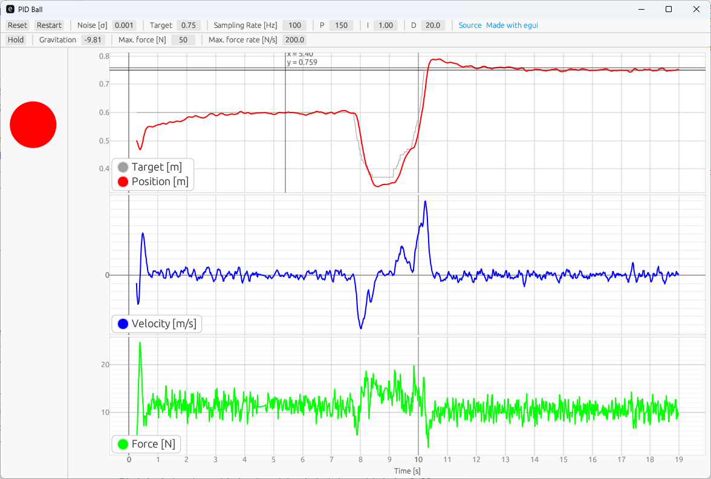

# PID Ball
Proportional–integral–derivative controller for a little floating ball. Build with [egui](https://github.com/emilk/egui/). Can be compiled to WASM or native executable. You can [try](https://raui100.github.io/pid_ball/) the WASM version online or check [this](https://github.com/emilk/eframe_template/#testing-locally) for compilation instructions.  

# About
I had built a little floating ball in university that had controlled the ball with a sensor to measure height and a PID controller that made the ball floating via electromagnetic forces. This is a fun project to simulate that floating ball. The physics should be nearly realtime and without an accumulating error. The induction has been simplified for the scope of this project. The induction is invisible, infinite small and the ball can pass right through. The noise on the sensor is normal distributed.